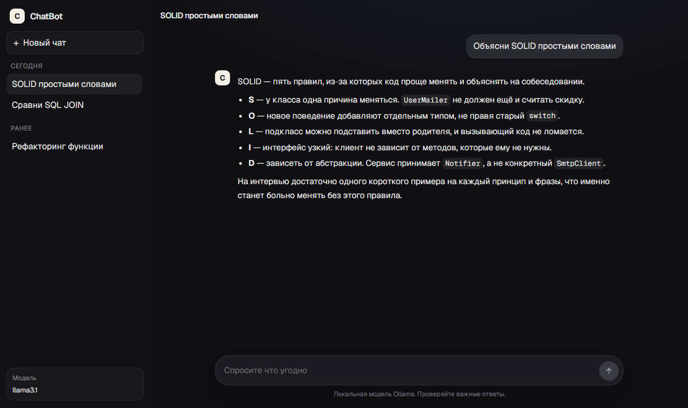

# ChatBot

AI-powered technical interview practice app with chat UI and Ollama LLM.



## Prerequisites
- Python 3.11+
- Node.js 18+
- MySQL 8+
- Ollama running locally (http://localhost:11434)

## Backend (FastAPI)

1. Create env:
   - Copy `backend/.env.example` to `backend/.env` and set values (DB + Ollama).
2. Install deps:
   ```bash
   cd backend
   python -m venv .venv && .venv/Scripts/activate
   pip install -r requirements.txt
   ```
3. Init DB (once):
   ```bash
   mysql -u root -p < database/chat.sql
   ```
4. Run server (from `backend/`):
   ```bash
   uvicorn app.main:app --host 0.0.0.0 --port 8000 --reload
   ```

## Frontend (Next.js)

1. Install and run:
   ```bash
   cd frontend
   npm i
   npm run dev
   ```

Open http://localhost:3000 — chat calls `http://localhost:8000`.

## Support

Операционная документация: [docs/SUPPORT.md](docs/SUPPORT.md) — конфигурация, API, база и типичные сбои.

## Notes
- Backend module path is `app.main:app` (package `backend/app`).
- UI uses `/api/chats`. Legacy routes `/api/chat/create`, `/api/chat`, `/api/chat/{id}/logs` are still mounted.
- `backend/database/chat.sql` creates database `chatBot`. `DB_NAME` in `.env` must match that name.
